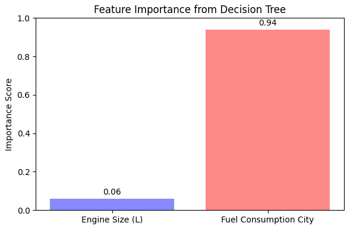
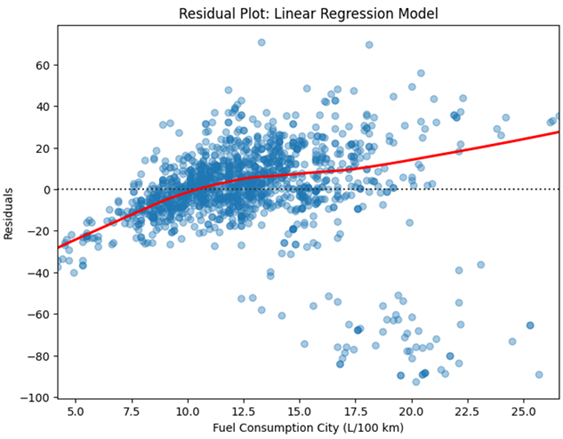

# 🚗 CO₂ Emissions Analysis using CLI & Spark MLlib  

## 📌 Project Objective  

**Hypothesis:** *Larger engines always produce more CO₂ emissions.*  

This project uses the **CO₂ Emissions dataset** (vehicle-level records of light-duty cars and trucks from Natural Resources Canada) to test whether **engine size** and **fuel consumption** are significant predictors of CO₂ emissions.  

**Focus Areas**:  
1. Extracting statistical correlations  
2. Employing Spark MLlib machine learning models  
3. Visualizing data-driven insights  

---

## 📊 Dataset Metadata  

- **Entries:** 7,385 rows  
- **Features:** Make, Model, Vehicle Class, Engine Size (L), Cylinders, Transmission, Fuel Type, Fuel Consumption (City/Hwy/Combined), CO₂ Emissions (g/km)  
- **Key Stats:**  
  - Average CO₂ Emissions: **250.6 g/km**  
  - Engine Size Range: **0.9 – 8.4 L** (Mean: 3.16 L)  
  - Fuel Consumption City Range: **4.2 – 30.6 L/100km** (Mean: 12.56)  
- **Top Vehicle Makes:** Ford, Chevrolet, BMW, Mercedes-Benz, Porsche  

---

## ⚙️ CLI & Spark ML Implementation  

1. **Preprocessing (CLI Tools):**  
   - Used `head`, `tail`, `wc`, `awk`, `sed`, `cut`, `sort`, `uniq` for raw CSV exploration  
   - Extracted key stats: CO₂, engine size, and city fuel consumption  

2. **Data Loading (Spark):**  
   - `spark.read.format("csv")` with schema inference → DataFrame  

3. **Feature Selection:**  
   - **Inputs:** Engine Size (L), Fuel Consumption City (L/100 km)  
   - **Target:** CO₂ Emissions (g/km)  

4. **ML Pipelines (Spark MLlib):**  
   - `VectorAssembler` → combined features  
   - `randomSplit` → 80/20 train-test  
   - Models: **DecisionTreeRegressor**, **LinearRegression**  

5. **Evaluation:**  
   - Compared **RMSE** (Root Mean Square Error)  
   - Analyzed **coefficients** (linear regression)  
   - Checked **feature importances** (decision tree)  

---

## 🔎 Findings (Nontrivial Insights)  

- **Key Insights:**  
  - Bigger engines emit more CO₂, but **city fuel consumption** is a **far stronger predictor**  
  - This challenges the simple assumption *“Larger engines always produce more CO₂”*  

---

## 📈 Visualizations  

**1. Feature Importance (Decision Tree)**  
- Fuel consumption dominates as the most important factor. 
  
 

**2. Residual Plot (Linear Regression)**  
- Non-linear residual patterns suggest linear regression is less suitable than tree-based models.
  

